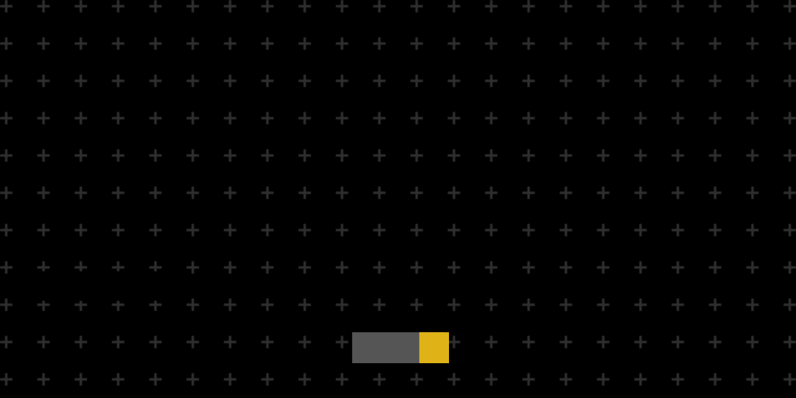

<h1 align="center" id="title">LaraZone (Forum/Discussion platform made using Laravel)</h1>

<p align="center"></p>

## Overview

LaraZone is a feature-rich discussion platform/forum developed using Laravel. It has features like creating thread, post, reply, send notifications, follow threads, user badges, admin panel, content reporting, up and down votes etc.

## Demo

View live demo here: https://larazone.free.nf

## Project Highlights

-   **Planning and Design:**

    -   Built a user-friendly discussion platform from scratch.
    -   Used Laravel's MVC architecture for a scalable and easy-to-maintain codebase.

-   **Frontend Development:**

    -   Created a responsive and simple UI with HTML, Tailwind CSS, and JavaScript.
    -   Utilized DaisyUI for streamlined and visually appealing frontend components.

-   **Backend Development:**

    -   Implemented robust backend functionality with Laravel, including authentication and authorization.

-   **Database Management:**

    -   Designed and optimized the database schema for efficient data storage and retrieval.
    -   Implemented Eloquent ORM for easy interaction with the database.

-   **Security Measures:**

    -   Implemented input validation for protection against common web vulnerabilities.
    -   Ensured secure user authentication using Laravel Breeze.

-   **Thread and Post Management:**

    -   User-friendly interface for creating threads, posts, and replies.
    -   Integrated a WYSIWYG editor for enhanced text formatting.
    -   Implemented pagination for smooth navigation.

-   **Search and Filtering:**

    -   Robust search feature for finding content efficiently and quickly.
    -   Advanced filtering options to refine search results.

-   **User Interaction and Engagement:**

    -   Voting system to boost community engagement.
    -   Notification system to keep users updated.
    -   Users can follow specific categories.

-   **Authentication and Authorization:**

    -   Integrated Google login for ease and security.
    -   Role-based access control for authorized features.

-   **Admin Dashboard:**

    -   Exclusive dashboard for admins and moderators.
    -   Admins can manage user roles, badges, and assign/revoke moderator status.

-   **Category Management:**

    -   Admins can create and edit forum categories to organize discussions.

-   **User Badge System:**

    -   Added a badge system that evolves based on user activity and reputation.

-   **Admin and Moderator Responsibilities:**
    -   Ability to update user badges and manage users, threads, and posts.
    -   Ability to manage user reported contents(such as threads and posts).

## 🛠️ Installation Steps:

<p>1. Install Composer</p>

```
https://getcomposer.org/
```

<p>2. Clone the project</p>

```
https://github.com/Riju-88/larazone.git
```

<p>3. Install the Laravel packages and dependencies</p>

```
composer install
```

<p>4. Install Node JS and Node packages</p>

```
npm install
```

<p>5. Create the .env file by running the following command:</p>

```
cp .env.example .env
```

<p>6. Re-configure the mail information in the .env for using email features. It'll be set to these values by default:</p>

```
MAIL_MAILER=smtp MAIL_HOST=mailpit MAIL_PORT=1025 MAIL_USERNAME=null MAIL_PASSWORD=null MAIL_ENCRYPTION=null MAIL_FROM_ADDRESS="hello@example.com" MAIL_FROM_NAME="${APP_NAME}"
```

<p>7. Add Google Client ID, Secret and redirect URI to use google login feature</p>

```
GOOGLE_CLIENT_ID=  GOOGLE_CLIENT_SECRET=  GOOGLE_REDIRECT_URI=
```

<p>8. Generate a new application key by running this command:</p>

```
php artisan key:generate
```

<p>9. Run the migrations to generate tables:</p>

```
php artisan migrate
```

<p>10. Start the node server:</p>

```
npm run dev
```

<p>11. Start the app:</p>

```
php artisan serve
```

<h2>💻 Built with</h2>

Technologies used in the project:

-   [Laravel](https://laravel.com/)
-   [Alpine JS](https://alpinejs.dev/)
-   [Tailwind CSS](https://tailwindcss.com/)
-   [Filament PHP](https://filamentphp.com/)
-   [DaisyUI](https://daisyui.com/)
-   JavaScript
-   [Trix Editor](https://trix-editor.org/) (WYSIWYG Editor)
-   [Socialite](https://laravel.com/docs/socialite) (Google Login AP)

<h2>🌟 Like my work?</h2>

Feel free to reach out if you’d like to hire me or need support regarding this project. Contact me at rijumistri4@gmail.com
